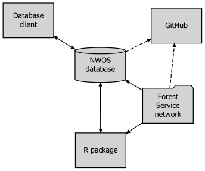

The National Woodland Owner Survey (NWOS) Database: Database Description
and Users’ Manual Version 1.0
================
Jesse Caputo, Brett Butler, Emma Sass
January 29, 2020

## Chapter 1 - Introduction

### Purpose of this Manual

This manual is intended to serve as the official guide to the National
Woodland Owner Survey (NWOS) database. It serves two broad purposes. One
is to provide guidance for the access, use, and interpretation of data
by those with access privileges. At present time, this is limited to
USDA employees and those partners with appropriate non-disclosure
agreements in place. The second purpose is to provide transparency and
to provide reference for those interested in the operational and
statistical methodology underlying the NWOS (Butler et al. IN REVIEW
(weighting), Butler et al. IN REVIEW)

The manual has four chapters. The remainder of chapter 1 provides
general introduction to the National Woodland Owner Survey (NWOS) and
the NWOS database. It provides a brief summary of the place of the NWOS
within the larger FIA program. It also provides an overview of the
design philosophy behind the NWOS database, as well the ecosystem of
data and tools within which it functions. Chapter 2 provides a brief
overview of the NWOS sample and the process of survey implementation. In
a fundamental sense, these define the types of data that are stored
within the database. Chapter 3 describes the tables that constituent the
database, their functions, and the conceptual logic that links them
together (definitions of each field and key in each table, including
codes, are included in Supplement 1). Chapter 4 provides guidance on
accessing NWOS data using the ‘nwos’ R package (Butler and Caputo 2019).
It is hoped that this chapter provides sufficient guidance for a user to
access NWOS data in a standardized and convenient format, given only
basic familiarity with R usage and syntax.

The names of tables and table fields (i.e. columns or attributes) are by
convention capitalized in this report (e.g. PLOT\_OWNER or OWNCD). In
the most cases, the association of a given field with a given table is
clear given the verbal context (e.g. “In the SAMPLE table, the field
NWOS\_STUDY is used for…”). Where the association needs to be made
explicit, the report uses a compound naming convention consisting of the
table name followed by the field name, separated by a period
(e.g. PLOT\_OWNER.OWNCD).

### The National Woodland Owner Survey(s)

The NWOS is part of the USDA Forest Inventory and Analysis (FIA)
program. It is one of the three primary components of the program, along
with the Timber Products Output (TPO) survey and the core FIA
biophysical inventory. The purpose of TPO is provide national and
regional estimates of wood products production; the survey is
administered to primary wood products manufacturers designed to elicit
the type and quantity of wood products produced as well as other
attributes (Coulston et al. 2018). The biophysical inventory (sometimes
referred to generically as “the” FIA sample) at its most basic consists
of a national network of ground plots that are used to estimate “..the
extent, condition, volume, growth, and depletions of timber..” (Burrill
et al. 2017) across the entire United States, including U.S. affiliated
territories (e.g. islands). The National Woodland Owner Survey (NWOS)
was developed to complement these other two components. Its intended
purpose is to better understand the self-reported motivations,
activities, intentions, and demographics of private U.S. forest
landowners. The primary instruments of the NWOS are landowner
questionnaires.

The main module\[1\] of the NWOS (called the ‘base’ or ‘rural’ NWOS) has
historically been tied to the network of FIA ground plots (excluding
U.S. territories). The population of interest to the NWOS is private,
forest landowners and the survey stratum of interest is the subset of
FIA plots that were found to be both forested and privately-owned. The
land use and ownership of these plots are known from the results of the
inventory and associated contact information is used to develop the NWOS
mailing list. This approach carries with it a number of advantages,
including the adoption of a rigorous, pre-existing sample and the
ability to link questionnaire responses back to measures of physical
attributes of the land. When necessary to achieve adequate sample sizes,
this base sample has been intensified using a complementary methodology
(a more detailed description of the sampling methodology can be found in
Chapter 2 or Westfall et al. IN REVIEW).

In recent history, FIA – including the NWOS – has been expanding its
purview beyond rural, forested landownership. A network of Urban FIA
ground plots (similar to the standard network of ‘rural’ ground plots)
has been established in multiple cities, in order to assess urban tree
cover and forest resources. Subsequently, an urban version of the NWOS
(the National Landowner Survey) was piloted in multiple cities before
being implemented fully in six cities in 2019. This survey is aimed at
understanding the values, activities, and perspective of the private
owners of urban green space.

The Urban National Landowners Survey is only the first of several new
‘flavors’ of NWOS studies that are in various stages of development.
In 2019, a separate version of the NWOS was administered to large
corporate ownerships, defined as ownerships owning more than 45,000
acres (Caputo et al. 2017). This marked the first time that a separate,
custom-written survey instrument was created for a specific substratum
of the NWOS sampling frame. In the past, a single, generalized
instrument was administered to family, corporate, non-profit, and other
private ownerships alike. Moving forward, there is great interest in
creating customized survey instruments for all such substrata.
Currently, surveys are being discussed or developed for island
territories and tribal ownerships. In the future, similar efforts for
other forest private ownerships, non-forest (i.e. “all-lands”)
ownerships, or even public ownerships may be undertaken. The NWOS
database is being developed as a common repository for all surveys
falling under the NWOS (or NLS) banner.

**Figure 1. Relationships among elements in the NWOS database
“ecosystem”. Data is accessed directly through a database client
(e.g. PL/SQL, SQL\*Plus) or by using the ‘nwos’ R package. The database
is updated in turn through the use of the same package, through the
client, or through implementation scripts stored on the Forest Service
network. A repository on the internal Forest Service GitHub contains a
copy of these implementation scripts as well as the scripts and tools
defining the database. Solid lines refer to transfer of data. Dashed
lines refer to transfer of scripts/code.**

**Figure 2. Relationships among FS\_NWOS survey tables. Primary keys (in
underline), foreign keys (identified with a tilde) and a subset of
additional fields are shown.**

**Figure 3. Relationships among FS\_NWOS administrative tables. Primary
keys (in underline), foreign keys (identified with a tilde) and a subset
of additional fields are shown. The MODIFICATIONS and NOTES tables can
be joined to any other tables (including survey tables) through the
RECORD and TABLE\_CN fields.**

1.  A survey ‘module’ is also referred to more generally as a ‘survey’,
    or as a ‘study’ within portions of the NWOS database and associated
    literature.
